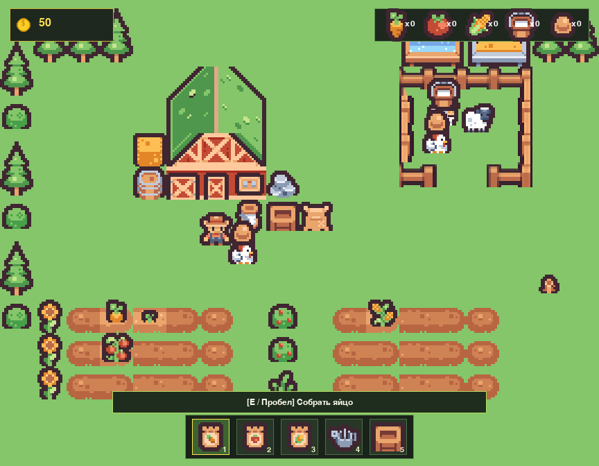

# 🌾 Весёлая ферма (Kenney Tiny Farm)

Красочная 2D-игра про ферму на Python, написанная на чистом **Pygame Zero** (`pgzero`).
В игре использованы тайлы и спрайты из набора [Kenney Tiny Farm](https://kenney.nl/assets/tiny-farm) (лицензия CC0).



---

## ✨ Возможности игры

- 🥕 **Огородничество:** посадка моркови, томатов и кукурузы на грядках.
- 💧 **Полив:** грядки требуют полива из лейки для быстрого созревания.
- 🐔 **Животноводство:** загон с курочками и коровкой — сбор свежих яиц и молока.
- 💰 **Экономика:** продажа урожая и продуктов через торговый ящик скупщика.
- 🎒 **Инвентарь и хотбар:** удобное переключение между семенами и инструментами.

---

## 🎮 Управление

| Действие | Клавиши / Мышь |
| :--- | :--- |
| **Перемещение** | `W`, `A`, `S`, `D` или `Стрелочки` |
| **Выбор в хотбаре** | Цифры `1` – `5` или клик мыши по слоту |
| **Действие / Взаимодействие** | `E` или `Пробел` |
| **Слот 1** | Семена моркови |
| **Слот 2** | Семена томата |
| **Слот 3** | Семена кукурузы |
| **Слот 4** | Лейка (полив грядок) |
| **Слот 5** | Рука / Сбор урожая |

---

## 🚀 Установка и запуск

### 1. Клонирование репозитория
```bash
git clone https://github.com/meow67676767/farm-game.git
cd farm-game
```

### 2. Установка зависимостей
```bash
pip install -r requirements.txt
```

### 3. Запуск игры
Игру можно запустить любым из двух способов:

Через раннер Pygame Zero:
```bash
pgzrun farm_game.py
```

Или напрямую через Python:
```bash
python farm_game.py
```

---

## 📁 Структура проекта

- `farm_game.py` — основной исходный код игры на чистом Pygame Zero.
- `images/` — все необходимые спрайты (тайлы, персонаж, животные, HUD).
- `kenney_tiny-farm/` — оригинальный пакет ассетов Kenney с лицензией CC0.
- `requirements.txt` — зависимости проекта (`pgzero`, `pygame`).
- `farm_game_screenshot.png` — скриншот игрового процесса.